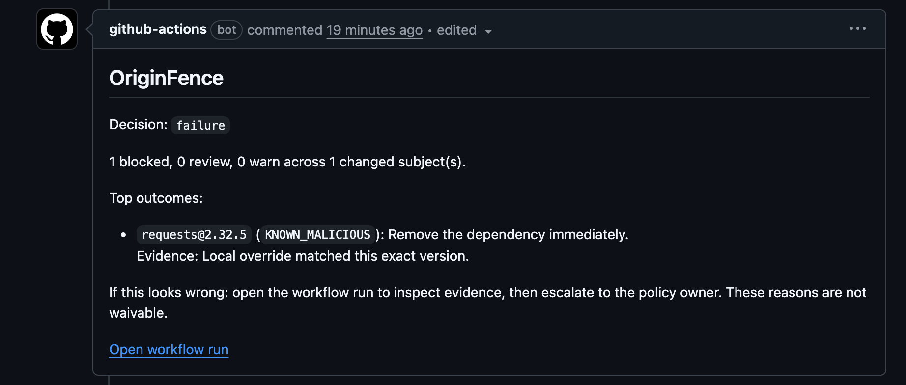
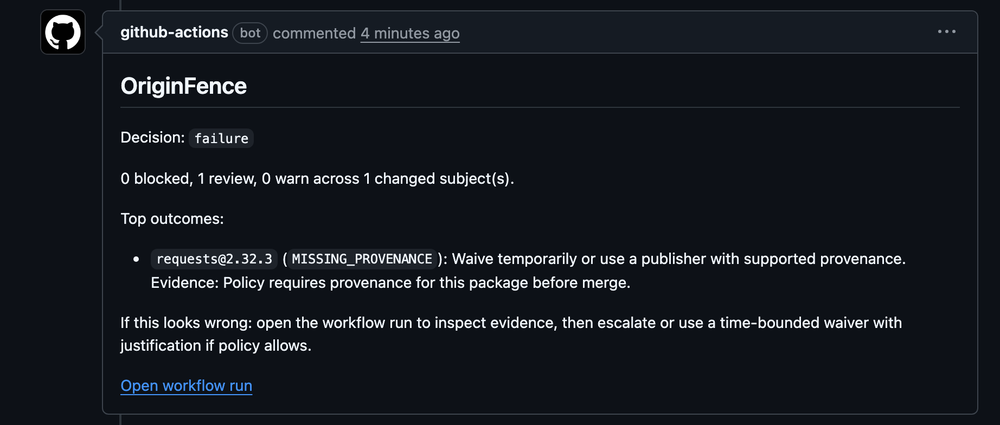
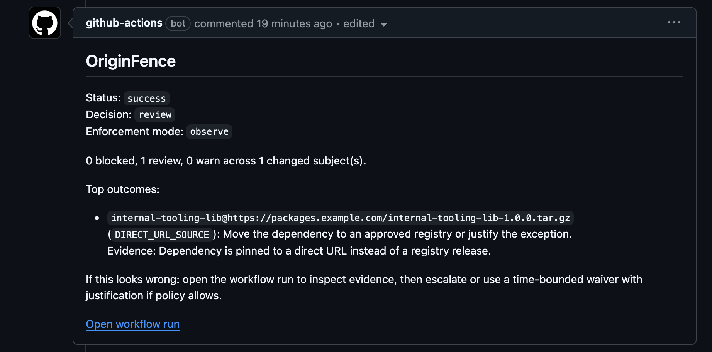
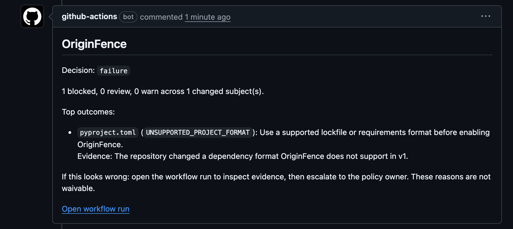

# OriginFence

[](https://github.com/ctrlzmydecisions/originfence/actions/workflows/ci.yml)
[](https://github.com/ctrlzmydecisions/originfence/actions/workflows/originfence-self-trial.yml)

Trust new dependency changes before they land.

OriginFence reviews dependency changes in pull requests and tells you whether to trust them before merge.

It looks only at the packages added or changed in a PR, then decides whether to `allow`, `warn`, `review`, or `block` them using repo policy, waivers, provenance checks, malicious-package intelligence, and upstream registry signals.

It is built for teams that want trust decisions at merge time, in GitHub, with policy and waivers kept in the repo.

Status:
- `alpha`
- supported ecosystems: `npm`, `PyPI`
- primary surface: `GitHub pull_request` and `merge_group` workflows
- release tags publish an attested `originfence-action-<tag>.tgz` bundle built from the tagged source

OriginFence is intentionally narrow:
- GitHub pull-request and merge-queue workflows only
- `npm` and `PyPI` only
- changed dependency subjects only, not historical inventory debt
- merge-time trust decisions, not dependency updates, vulnerability triage, or package proxying

This repo dogfoods OriginFence on its own pull requests in `observe` mode via [`.github/workflows/originfence-self-trial.yml`](./.github/workflows/originfence-self-trial.yml).

For production-style rollout, treat `.originfence/*`, [`.github/CODEOWNERS`](./.github/CODEOWNERS), [`.github/workflows/`](./.github/workflows), [action.yml](./action.yml), and [`bundle/github-action`](./bundle/github-action) as sensitive control-plane files.

## What It Does

OriginFence focuses on the merge boundary:
- new or changed packages in a PR
- hard signals like known malicious packages and quarantined upstream states
- policy decisions that stay with the repo
- output that developers can read in the pull request itself

## What It Catches

- known malicious packages and upstream quarantine signals
- missing or invalid provenance where policy requires it
- direct URL and VCS dependencies
- manifest and lockfile drift
- unsupported dependency layouts it cannot evaluate exactly

## In The Pull Request

### Malicious Package Block

When a package matches malicious-package intelligence, OriginFence is intentionally blunt:



### Missing Provenance Review

When policy requires provenance, OriginFence shows the missing evidence directly in the PR:



### Safe Rollout

You can start in `observe` mode so the check stays green while people see the real decision and next action:



### Fail Fast On Unsupported Layouts

If OriginFence cannot evaluate a dependency layout exactly, it says so explicitly instead of pretending partial coverage:



## Getting Started

Add a workflow like this to the consumer repository:

```yaml
name: OriginFence

on:
  pull_request:
  merge_group:
    types:
      - checks_requested

permissions:
  contents: read
  pull-requests: write
  issues: write

jobs:
  originfence:
    runs-on: ubuntu-latest

    steps:
      - name: Checkout merge candidate
        uses: actions/checkout@v6
        with:
          fetch-depth: 2

      - name: Restore OriginFence cache
        uses: actions/cache/restore@v5
        with:
          path: .originfence/cache
          key: ${{ runner.os }}-originfence-${{ github.repository }}-${{ github.ref_name || github.ref }}-${{ github.sha }}
          restore-keys: |
            ${{ runner.os }}-originfence-${{ github.repository }}-${{ github.ref_name || github.ref }}-
            ${{ runner.os }}-originfence-${{ github.repository }}-

      - name: Run OriginFence
        id: originfence
        uses: ctrlzmydecisions/originfence@85183e0f338e23444146461bd1e5938ab5e0af85
        with:
          enforcement-mode: observe
          write-job-summary: "true"
          pr-comment: "true"
          comment-mode: review_and_block
          github-token: ${{ secrets.GITHUB_TOKEN }}

      - name: Upload OriginFence artifacts
        if: always()
        uses: actions/upload-artifact@v7
        with:
          name: originfence-report-${{ github.run_id }}-${{ github.job }}
          path: |
            ${{ steps.originfence.outputs.report-path }}
            ${{ steps.originfence.outputs.summary-path }}

      - name: Save OriginFence cache
        if: always()
        uses: actions/cache/save@v5
        with:
          path: .originfence/cache
          key: ${{ runner.os }}-originfence-${{ github.repository }}-${{ github.ref_name || github.ref }}-${{ github.sha }}
```

Reference examples:
- [`examples/repo/.github/workflows/originfence-required-check.yml`](./examples/repo/.github/workflows/originfence-required-check.yml)
- [`.github/workflows/originfence-reusable.yml`](./.github/workflows/originfence-reusable.yml)

For convenience or trial rollouts, you can still use a moving major tag:

```yaml
- uses: ctrlzmydecisions/originfence@v0
```

For higher-trust deployment, prefer a full commit SHA. GitHub documents a full-length commit SHA as the only immutable way to pin an action version.

## High-Trust Deployment Model

If you want PR authors to be unable to weaken the gate in the same change, keep a baseline policy outside PR control and layer repo-local policy on top of it.

Recommended pattern:
- keep a baseline policy in a separate security-owned repository or another path the PR head cannot rewrite
- pass that file through `baseline-policy-path`
- keep repo-local `.originfence/policy.yaml` for stricter additions only
- protect `.originfence/*` with [`.github/CODEOWNERS`](./.github/CODEOWNERS) and branch rules once you have more than one maintainer

Example:

```yaml
jobs:
  originfence:
    runs-on: ubuntu-latest
    steps:
      - name: Checkout merge candidate
        uses: actions/checkout@v6
        with:
          fetch-depth: 2

      - name: Checkout security baseline policy
        uses: actions/checkout@v6
        with:
          repository: your-org/security-policy
          ref: main
          path: .originfence-baseline

      - name: Run OriginFence
        id: originfence
        uses: ctrlzmydecisions/originfence@85183e0f338e23444146461bd1e5938ab5e0af85
        with:
          baseline-policy-path: .originfence-baseline/originfence/baseline.policy.yaml
          policy-path: .originfence/policy.yaml
          waivers-path: .originfence/waivers.yaml
          enforcement-mode: observe
          github-token: ${{ secrets.GITHUB_TOKEN }}
```

OriginFence merges the baseline and repo policy in the stricter direction, so the repo-local policy can tighten the baseline but not weaken it.

## Release Integrity

GitHub Actions consume committed JavaScript bundles, so OriginFence still ships the Action as prebuilt bundled JavaScript at each tag. The release process now reduces that trust gap in three ways:
- CI fails if [`bundle/github-action`](./bundle/github-action) drifts from the TypeScript source
- published releases rebuild the Action from the tagged commit before packaging it
- each release uploads an attested `originfence-action-<tag>.tgz` bundle plus a `SHA256SUMS.txt` file

The attested release bundle is for verification. Consumers still install OriginFence the normal GitHub Action way:

```yaml
- uses: ctrlzmydecisions/originfence@v0
```

You can verify a release bundle with GitHub CLI:

```bash
gh release download v0.1.2-alpha -R ctrlzmydecisions/originfence -p 'originfence-action-*.tgz' -p 'SHA256SUMS.txt'
sha256sum --check SHA256SUMS.txt
gh attestation verify originfence-action-v0.1.2-alpha.tgz -R ctrlzmydecisions/originfence
```

## How It Decides

1. Compare the base revision to the PR head.
2. Resolve only the changed dependency subjects from supported manifests and lockfiles.
3. Gather registry metadata, cryptographically verified provenance signals, malicious-package intelligence, and OriginFence drift history.
4. Apply baseline policy, repo policy, and explicit waivers.
5. Emit a required-check result, job summary, optional sticky PR comment, and canonical JSON report.

## Rolling It Out

Recommended rollout path:

1. Add `.originfence/policy.yaml` and `.originfence/waivers.yaml` from a preset.
2. Start with `enforcement-mode: observe`.
3. Review job summaries and PR comments for a week or two.
4. Keep the cache step in place so drift history and provenance trust roots stay warm across runs.
5. Tune policy and waivers.
6. Move to a pinned-SHA action reference and a baseline policy outside PR control before relying on it as a blocking gate.
7. Switch to `enforcement-mode: enforce` when the repo is ready.

Preset entry points:
- [`presets/observe.policy.yaml`](./presets/observe.policy.yaml)
- [`presets/balanced.policy.yaml`](./presets/balanced.policy.yaml)
- [`presets/strict.policy.yaml`](./presets/strict.policy.yaml)
- [`presets/waivers.yaml`](./presets/waivers.yaml)

If you are running OriginFence from a local checkout, you can bootstrap config files directly:

```bash
npm install
npm run build:test
node dist/src/cli.js init --preset observe
```

## Where Signals Come From

OriginFence evaluates malicious-package signals in this order:
- optional local override entries from `malicious-packages-file` for emergency or org-specific blocks
- OpenSSF malicious-packages through OSV
- GitHub npm malware advisories as a supplemental npm source

PyPI project status is treated separately as a hard upstream registry signal.

OriginFence keeps HTTP cache, drift snapshots, and provenance trust-root state under `.originfence/cache` by default. Persist that directory with `actions/cache` if you want drift signals and provenance verification to stay warm on GitHub-hosted runners.

## Outputs

OriginFence always writes:
- a canonical JSON report
- a plain-text summary

In GitHub, OriginFence maps decisions to required-check-friendly statuses:
- `success`: only `allow` and `warn`
- `failure`: any `review` or `block`
- `neutral`: no supported dependency changes were detected

In `observe` mode, OriginFence keeps the underlying decision in the report and human-readable output, but remaps the workflow status to `success` so repos can tune policy without merge disruption.

## Limits

- GitHub is the only first-class delivery surface in v1.
- OriginFence supports `npm` and `PyPI` only.
- OriginFence evaluates changed subjects only; it is not a full historical dependency inventory scanner.
- OriginFence is a PR gate, not a transparent package proxy.
- Python support covers common `requirements.txt` specifiers, include files, direct references, and editable VCS entries. `uv.lock` still gives OriginFence the strongest exact-resolution path.
- Provenance verification is strongest for exact releases. For Python, `uv.lock` or tightly pinned `requirements.txt` gives OriginFence the cleanest evidence path.

## Developing

```bash
npm install
npm run build
npm test
```

The public repo includes the test suite and fixture corpus used by `npm test`, so contributors can validate behavior locally instead of relying only on screenshots or release notes.

Useful paths:
- [`action.yml`](./action.yml)
- [`schemas/`](./schemas)
- [`fixtures/`](./fixtures)
- [`examples/`](./examples)
- [`presets/`](./presets)
- [`scripts/run-live-canaries.js`](./scripts/run-live-canaries.js)

## Files

- [`CHANGELOG.md`](./CHANGELOG.md)
- [`LICENSE`](./LICENSE)
