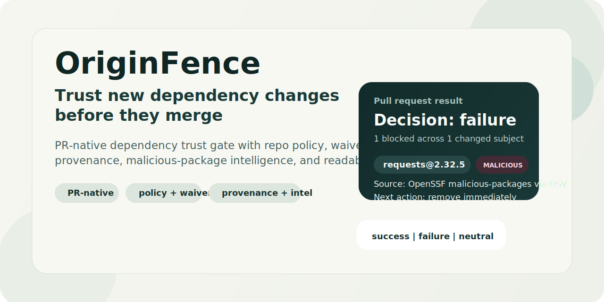

# OriginFence

Catch risky dependency changes before they merge.

OriginFence is a GitHub-native dependency trust gate for pull requests. It reviews only the packages introduced or changed in a PR, then decides whether to `allow`, `warn`, `review`, or `block` them using repo policy, waivers, provenance checks, malicious-package intelligence, and upstream registry signals.



What you get:
- merge-time decisions instead of another security dashboard
- explainable PR comments and job summaries developers can act on
- repo-local policy with explicit, time-bounded waivers
- malicious-package intelligence, provenance, and registry evidence in one decision
- safe rollout with `observe` mode before turning merge blocking on

Status:
- `alpha`
- supported ecosystems: `npm`, `PyPI`
- primary surface: `GitHub pull_request` and `merge_group` workflows

## Why It Exists

Most dependency tooling answers a different question: "Is this package vulnerable?" OriginFence answers "Should this new dependency change be trusted before it lands?"

That means it focuses on the merge boundary:
- new or changed packages in a PR
- hard signals like known malicious packages and quarantined upstream states
- policy decisions that stay with the repo
- output that developers can read in the pull request itself

## What OriginFence Catches

- known malicious packages and upstream quarantine signals
- missing or invalid provenance where policy requires it
- direct URL and VCS dependencies
- manifest and lockfile drift
- unsupported dependency layouts it cannot evaluate exactly

## What Developers See

### Malicious Package Block

When a package matches malicious-package intelligence, OriginFence is intentionally blunt:


### Missing Provenance Review

When policy requires provenance, OriginFence shows the missing evidence directly in the PR:


### Safe Rollout

You can start in `observe` mode so the check stays green while people see the real decision and next action:


### Fail Fast On Unsupported Layouts

If OriginFence cannot evaluate a dependency layout exactly, it says so explicitly instead of pretending partial coverage:


## Why OriginFence

OriginFence is not trying to replace every supply-chain control. It fills a specific gap: an open-source, repo-native PR trust gate with policy, waivers, and explainable trust decisions.

| Option | Best fit | Primary enforcement surface | Repo-local policy and waivers | Open source |
| --- | --- | --- | --- | --- |
| OriginFence | PR trust decisions for new dependency changes | Required GitHub workflow | Yes | Yes |
| GitHub Dependency Review | vulnerability, license, age, and dependency-change context in pull requests | GitHub dependency review and dependency-review-action | No dedicated trust-policy or waiver layer | No |
| Socket | managed package-risk evaluation through GitHub App, CLI, API, and firewall products | GitHub App, CLI, API, wrapper and proxy surfaces | Vendor-managed | No |
| Sonatype Repository Firewall | central repository-manager ingress control and quarantine | Nexus Repository or Artifactory perimeter | Central admin policy | No |

Use GitHub Dependency Review when you mainly want vulnerability and license review inside GitHub. Use Socket or Sonatype when you want a vendor-managed platform or proxy or perimeter control. Use OriginFence when you want an open-source PR gate whose policy lives with the repo.

## Quickstart

Add a workflow like this to the consumer repository:

```yaml
name: OriginFence

on:
  pull_request:
  merge_group:
    types:
      - checks_requested

permissions:
  contents: read
  pull-requests: write
  issues: write

jobs:
  originfence:
    runs-on: ubuntu-latest

    steps:
      - name: Checkout merge candidate
        uses: actions/checkout@v4
        with:
          fetch-depth: 2

      - name: Run OriginFence
        id: originfence
        uses: OWNER/originfence@v0
        with:
          enforcement-mode: observe
          write-job-summary: "true"
          pr-comment: "true"
          comment-mode: review_and_block
          github-token: ${{ secrets.GITHUB_TOKEN }}

      - name: Upload OriginFence artifacts
        if: always()
        uses: actions/upload-artifact@v4
        with:
          name: originfence-report-${{ github.run_id }}-${{ github.job }}
          path: |
            ${{ steps.originfence.outputs.report-path }}
            ${{ steps.originfence.outputs.summary-path }}
```

Reference examples:
- [`examples/repo/.github/workflows/originfence-required-check.yml`](./examples/repo/.github/workflows/originfence-required-check.yml)
- [`.github/workflows/originfence-reusable.yml`](./.github/workflows/originfence-reusable.yml)

## How It Works

1. Compare the base revision to the PR head.
2. Resolve only the changed dependency subjects from supported manifests and lockfiles.
3. Gather registry metadata, provenance signals, malicious-package intelligence, and OriginFence drift history.
4. Apply baseline policy, repo policy, and explicit waivers.
5. Emit a required-check result, job summary, optional sticky PR comment, and canonical JSON report.

## Rollout

Recommended rollout path:

1. Add `.originfence/policy.yaml` and `.originfence/waivers.yaml` from a preset.
2. Start with `enforcement-mode: observe`.
3. Review job summaries and PR comments for a week or two.
4. Tune policy and waivers.
5. Switch to `enforcement-mode: enforce` when the repo is ready.

Preset entry points:
- [`presets/observe.policy.yaml`](./presets/observe.policy.yaml)
- [`presets/balanced.policy.yaml`](./presets/balanced.policy.yaml)
- [`presets/strict.policy.yaml`](./presets/strict.policy.yaml)
- [`presets/waivers.yaml`](./presets/waivers.yaml)

If you are running OriginFence from a local checkout, you can bootstrap config files directly:

```bash
npm install
npm run build:test
node dist/src/cli.js init --preset observe
```

## Signal Sources

OriginFence evaluates malicious-package signals in this order:
- local override entries from `malicious-packages-file`
- OpenSSF malicious-packages through OSV
- GitHub npm malware advisories

PyPI project status is treated separately as a hard upstream registry signal.

## Outputs

OriginFence always writes:
- a canonical JSON report
- a plain-text summary

In GitHub, OriginFence maps decisions to required-check-friendly statuses:
- `success`: only `allow` and `warn`
- `failure`: any `review` or `block`
- `neutral`: no supported dependency changes were detected

In `observe` mode, OriginFence keeps the underlying decision in the report and human-readable output, but remaps the workflow status to `success` so repos can tune policy without merge disruption.

## Current Limits

- GitHub is the only first-class delivery surface in v1.
- OriginFence supports `npm` and `PyPI` only.
- OriginFence evaluates changed subjects only; it is not a full historical dependency inventory scanner.
- OriginFence is a PR gate, not a transparent package proxy.
- Provenance is useful evidence, not proof that a package is safe.
- The repository ships the Action as prebuilt bundled JavaScript; npm package publishing is not set up yet.

## Local Development

```bash
npm install
npm run build
npm test
```

The public repo includes the test suite and fixture corpus used by `npm test`, so contributors can validate behavior locally instead of relying only on screenshots or release notes.

Useful paths:
- [`action.yml`](./action.yml)
- [`schemas/`](./schemas)
- [`fixtures/`](./fixtures)
- [`examples/`](./examples)
- [`presets/`](./presets)
- [`scripts/run-live-canaries.js`](./scripts/run-live-canaries.js)

## Project Files

- [`CHANGELOG.md`](./CHANGELOG.md)
- [`LICENSE`](./LICENSE)
